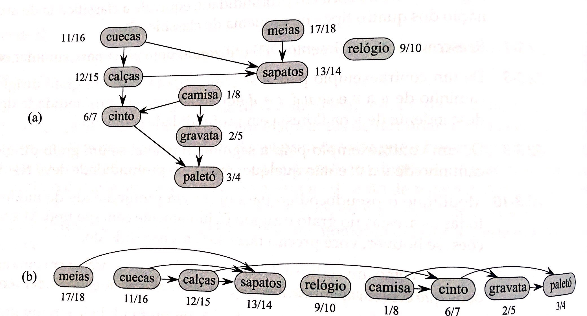
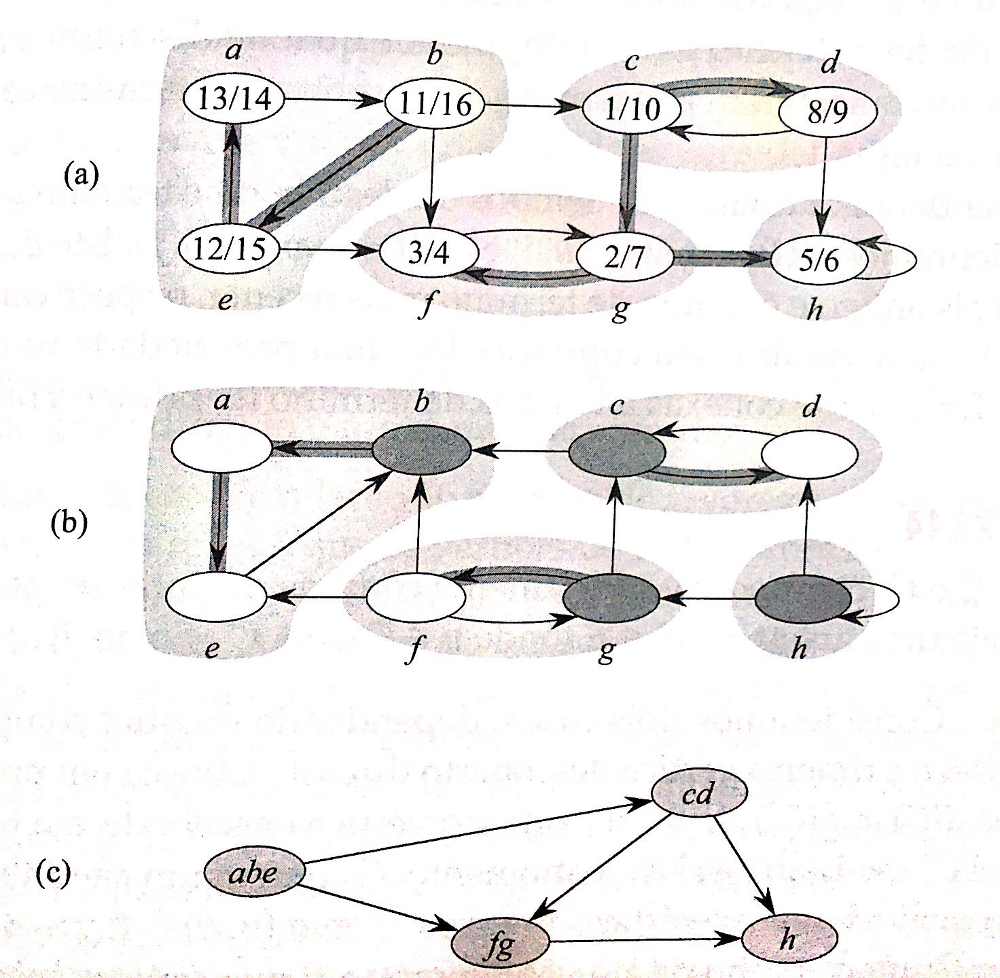
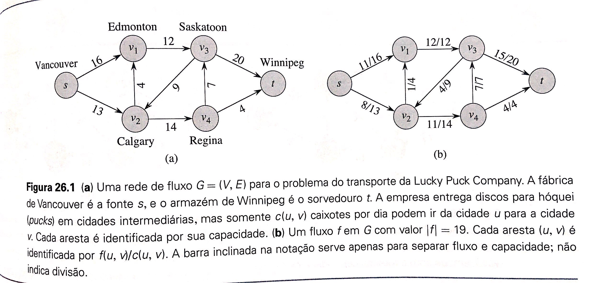

# TCC1 - Visão Geral

Conceitos que pretendo utilizar

**Conceitos básicos**
- Aresta
  - Grau
- Vértice
- Grafo

---
## Ordenação topológica

A ordenação topológica de um _grafo acíclico dirigido_ `G = (V,E)` é uma ordenação linear de todos os seus vértices, tal que se `G` contém uma aresta `(u,v)`, então `u` aparece antes de `v` na ordenação.

---
## Componentes fortemente conexas

Componente formtemente conexa de um grafo dirigido é um conjunto máximo de vértices `C` tal que, parta todo par de vértices `u` e `v` em `C`, temos `u->v` e `v->u`, isto é, `u` pode ser alcançado a partir do vértice `v` e vice-versa.

_Avaliar aplicar para grafo não dirigido_.

---
## Caminhos mínimos entre todos os pares

Pode ser usado para calcular o quanto uma aresta está distante da outra.

---
## Redes fluxos

