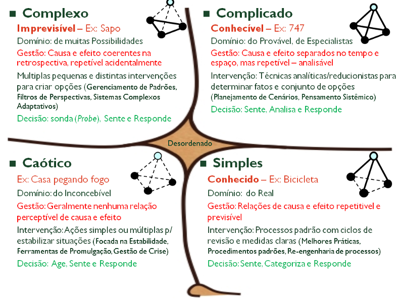

# Visão Geral - Estrutura

## 1. Introdução

- Cynefin framework

- Exemplos?
  - Grade de engenharia de sistemas
  - CMMI?

## 2. Pensamento sistêmico

### Bounded rationality
Bounded rationality means that people make quite reasonable decisions based on the information they have. But they
don't have perfect information, especially about more distant parts of the system

### Success to successful
If the Winners of a competition are systematically
rewarded with the means to win again, a reinforcing
feedback loop is created by which, if it is allowed to
proceed uninhibited, the winners eventually take all,
while the losers are eliminated.

### Drift to low performance
Allowing performance standards to be influenced by
past performance, especially if there is a negative
bias in perceiving past performance, sets up a
reinforcing feedback loop of eroding goals that sets a
system drifting toward low performance.

### Seeking the wrong goal
System behavior is particularly sensitive to the goals
of feedback loops. If the goals—the indicators of
satisfaction of the rules—are defined inaccurately or
incompletely, the system may obediently work to
produce a result that is not really intended or wanted.